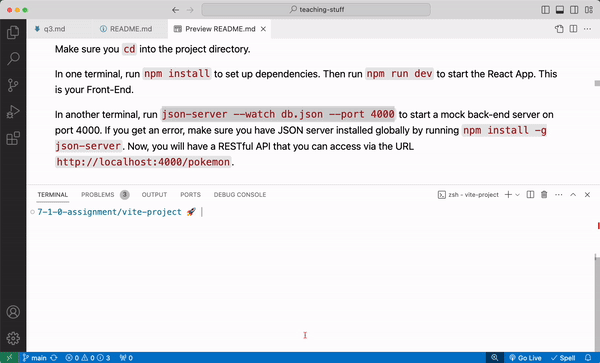

# 7-1-2 Assignment

You are the commander of an intergalatic robot army. You need an app that will allow you to see and orgnize the members of your army. You will practice using React Router to build a multi-page, front-end UI.


**Table of Contents**:
- [Short Responses](#short-responses)
- [Technical Checklist](#technical-checklist)
- [Features:](#features)
- [Set Up](#set-up)
- [Starter Code](#starter-code)
  - [Context Provider](#context-provider)
  - [React Router](#react-router)
  - [Semantic CSS](#semantic-css)
- [Challenge](#challenge)

## Short Responses

Getting tired of this message yet? Do them first!

## Technical Checklist

There are 14 tasks to complete and 1 bonus.

Your goal is to meet at least 75% of these requirements to complete the assignment. But don't stop there! Shoot for 100%!

**Functionality**
- [ ] Navigating to `/` renders the `BotsPage`
- [ ] Clicking on a robot navigates the user to `/robots:/id` where `:id` is the id of the clicked robot.
- [ ] Navigating to `/robots/:id` renders the `BotSpecsPage`
- [ ] The `BotSpecsPage` renders the robot whose `id` matches the `:id` portion of the URL
- [ ] Navigating to any other URL renders the `NotFoundPage` component
- [ ] Wherever the `GoHomeButton` component is rendered, clicking on the button navigates the user back to the `/` page.

**React Fundamentals**
- [ ] Uses `BrowserRouter` in `main.jsx` to provide routing to the entire `App`
- [ ] Uses `Routes` in `App.jsx` to render multiple Routes
- [ ] Uses `Route` to render a component based on the URL
- [ ] Uses `Link` to render a component that redirects the user upon click
- [ ] Uses `useParams` to get parts of dynamic URL
- [ ] Uses `useNavigate` to programmatically redirect the user

**Miscellaneous**
- [ ] Props are extracted in child components using destructuring
- [ ] At no point did you ever use any vanilla DOM JS methods (e.g. `document.querySelector` or `document.createElement`)
- [ ] Bonus: Your project has some extra CSS styling!

When you are finished, push your code up to Github and submit on Canvas.

## Features:

**The first two of these features are already implemented.** The last two features are not. That's where you come in! 

1. On load of the path `/`, you will make a `GET` fetch to an API and display all 50 robots on the page via the `BotsPage` component.
2. You should be able to filter the robots on the `/` page by `bot_class`, either Assault, Defender, or Support.
3. Clicking on a bot should change the URL path to `/robots/:id` and display a single robot via the `BotSpecsPage` component.
4. If the user types in any URL other than `/` or `/robots/:id`, a "Page Not Found" page is rendered via the `NotFoundPage` component.

You will need to utilize the following components and hooks from ReactRouter to complete these features:
- `BrowserRouter`
- `Routes`
- `Route`
- `Link`
- `useParams`
- `useNavigate`

## Set Up

Make sure you `cd` into the `vite-project` directory.

In one terminal, run `npm install` to set up dependencies. Then run `npm start` to start the React App. This is your Front-End.

In another terminal, run `npm run json-server` to start a mock back-end server on port 4000. This will turn the `db.json` file containing robot data into a working API with CRUD functionality.

**How to split your terminal**:



**If you get an error:**

If you get an error, make sure you have JSON server installed globally by running `npm install -g json-server`. Now, you will have a RESTful API that you can access via the URL `http://localhost:4000/robots`.

**Wait, what is JSON server again?**

JSON Server is a tool to we use to spin up a mock API. It is a great alternative when you don't have the time to build out a full Express API. It does have its limitation in that it cannot support a robust relationships database. Learn more by reading the [JSON Server documentation](https://github.com/typicode/json-server#getting-started).

## Starter Code

Like we said earlier, the first two features of the application are built for you. Take some time to understand the code that powers the app.

We've given you:
- `main.jsx` and `App.jsx` — the entry points of the application
- `/pages` — the main pages of the application
- `/components` — components used within the pages of the application
- `/context` - the Context and ContextProvider for the application.

There are _a lot_ of hints that the starter code gives you. Although you are allowed to change up the starter code however you'd like, it will be easiest to let the existing code guide you into building out this app.

Note that not all the components in the code are rendered on the DOM, but you should explore _and use_ these components!

### Context Provider

We have provided you with a Context for this project. Check out the `src/context/RobotProvider` file to see how this is currently set up. Check out the `src/main` file, `BotsList`, and `BotSpecs` to see where we use this provider.

### React Router

This assignment comes with React Router already installed. In order to build out this app, you may need to read the [React Router Documentation](https://reactrouter.com/web/guides/quick-start).

### Semantic CSS

Curious about the styles?

Take a look at the `index.html` file and you'll see a link to include Semantic UI stylesheet:

```html
<link rel="stylesheet" href="//cdnjs.cloudflare.com/ajax/libs/semantic-ui/2.2.12/semantic.min.css"></link>
```

_[Learn more about Semantic UI here](https://semantic-ui.com/)_

## Challenge

Looking for more?? This app that you've built is very similar to the personal pokedex app from the last assignment! Take a stab at incorporating React Router into that app. 

Build a `PokemonSpec` page and whenever you click on a pokemon, navigate the user to a `/pokemon/:id` URL and render the appropriate pokemon in your `PokemonSpec` page.
